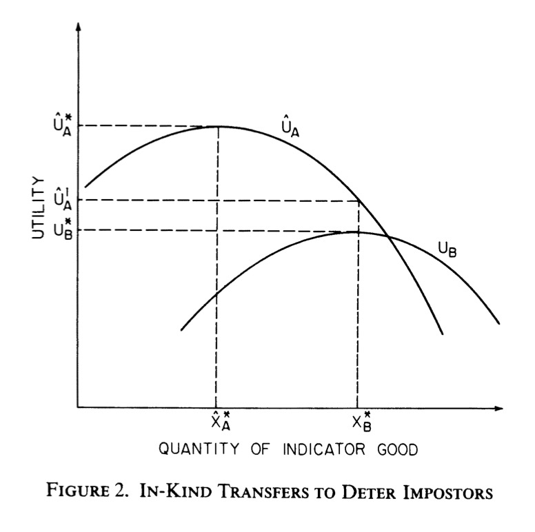

</style>

<style type="text/css">

body, td {
   font-size: 20px;
}

</style>

```{r setup, include=FALSE}
knitr::opts_chunk$set(echo = TRUE, warning=FALSE, message=FALSE)
```

\newcommand{\argmax}{\mathop{\mathrm{argmax}}}

# 1. Screening Theory  
\textit{Consider an economy with two types of individuals: those who are able ($a$) and
those who are not able ($d$). Let $u^a_w$ ($u^d_w$) denote the average utility of working for the able (not-able) type, and $u^a_b$ ($u^d_b$ ) denote the utility of receiving benefits for the able (not-able) type. Let $\epsilon$ represent
the idiosyncratic preference for working, with $\epsilon$ following a uniform distribution with range $[\underline{\epsilon}, \bar{\epsilon}]$ and 
density function $f(\epsilon) = \frac{1}{\bar{\epsilon} - \underline{\epsilon}}$. The utility of working for type $i \in \{a, d\}$ is given by $u_w^i + \epsilon$ and the utility of receiving benefits is $u_b^i - c^i$, where $c^i$ denotes the cost to type $i$ of applying for benefits.}  
  
## a.  
\textit{Write down the condition for type $i$ to apply for benefits.}  
  

I assume that applicants of benefits must forego work, and that once they do forgo work and apply, they will receive benefits with certainty. In order for type $i$ to apply for benefits, their utility of receiving benefits must exceed their utility of working and abstaining from applying. This is expressed as: 
\[u_b^i - c_b^i > u_w^i + \epsilon\]


## b.  
\textit{Derive an expression for the mass of type $i$ who apply for benefits.}  
  

In order for the condition derived above to hold, $\epsilon$ must satisfy: 
\[\epsilon < u_b^i - u_w^i - c^i\]
Since the idiosyncratic shock $\epsilon$ follows a uniform distribution, the mass of type $i$ who apply for benefits is proportional to the cumulative distribution function of $\epsilon$ evaluated at $u_b^i - u_w^i - c^i$. The cumulative distribution function of $\epsilon$ is: 
\[\begin{aligned}  
&\int _{\underline{\epsilon}} ^{u_b^i - u_w^i - c^i} \frac{1}{\bar{\epsilon} - \underline{\epsilon}} dx \\
=& [\frac{x}{\bar{\epsilon} - \underline{\epsilon}}]^{u_b^i - u_w^i - c^i}_{\underline{\epsilon}} \\
=& \frac{u_b^i - u_w^i - c^i - \underline{\epsilon}}{\bar{\epsilon} - \underline{\epsilon}}
\end{aligned}\]

This is the share of people of type $i$ to apply to benefits. 

## c.  

\textit{Consider an ordeal that increases the application cost for type $i$ from $c^i$ to $c^i+ \Delta c^i$ . Derive an expression of the change in the mass of type $i$ who apply for benefits.}  
  
  
The mass we derived earlier under cost $c^i$ is: 
\[\frac{u_b^i - u_w^i - c^i - \underline{\epsilon}}{\bar{\epsilon} - \underline{\epsilon}}\]
The mass under cost $c^i+\Delta c^i$ is:
\[\frac{u_b^i - u_w^i - c^i - \Delta c^i - \underline{\epsilon}}{\bar{\epsilon} - \underline{\epsilon}}\]
The difference between the two is 
\[\frac{u_b^i - u_w^i - c^i - \underline{\epsilon}}{\bar{\epsilon} - \underline{\epsilon}} - \frac{u_b^i - u_w^i - c^i - \Delta c^i - \underline{\epsilon}}{\bar{\epsilon} - \underline{\epsilon}} = \frac{\Delta c^i}{\bar{\epsilon} - \underline{\epsilon}}\]
This is the share of people of type $i$ that will be dissuaded from applying for benefits in the presence of this new ordeal.  

## d.  

\textit{Consider the following two cases. For each case, does the increase in ordeals improve or worsen targeting? What types of application costs are relevant to each case and why?}  

\begin{enumerate}  
\item[i.] $\Delta c^d < \Delta c^a$  
  

In this case, targeting is improved, since a greater share of able types are dissuaded from applying to benefits than non-able types. The ordeal will hurt non-able types, but not as much as it will deter applications by able-types. An example of such an application cost is an application process that demands long hours of being physically present at a venue for application. Since able types can gain higher utility from working, their opportunity cost of spending time waiting is larger than non-able types. Thus, time cost is more costly for them than it is for non-able types. 


\item[ii.] $\Delta c^d > \Delta c^a$  
  
  
In this case, targeting is worsened, since a greater share of non-able types are dissuaded from applying to benefits than able types. An example of such an application cost is an application process that requires complicated paperwork that non-able types may have more trouble navigating than able-types. Such cognitive costs are greater for non-able types than able types. 
\end{enumerate}

## e.  

\textit{What does this exercise tell us about the Nichols and Zeckhauser (1982) hypothesis?}  
  

The above provides a counterexample to Nichols and Zeckhauser's hypothesis. Nichols and Zeckhauser hypothesize that additional ordeals improve targeting by screening out high ability types. While this may be true, in case ii. of d., the opposite can occur. Thus, the effect of ordeals on screening depends on the type of ordeal.  
  
  
  
# 2. Screening; instrumental variables.  

\textit{Enrollment in social safety net programs often involves “ordeals” like waiting in line and completing complicated paperwork. Consider the Special Supplemental Nutrition Program for Women, Infants, and Children (WIC) program, which provides nutrition assis- tance to pregnant women, infants, and children.}  

## a.   

\textit{Suppose a state would like WIC benefits to go to type L mothers, but not type H mothers. The state cannot tell a mother’s type so it cannot tag. The state wants to distinguish between the two types of mothers by imposing documentation requirements for the program. A mother of type $i$ receives utility $v_i > 0$ from enrolling in WIC. Time spent gathering and providing documentation is wasted, so a mother of type $i$ who spends $t$ hours providing documentation loses utility $c_i t$, where $c_i > 0$. Thus the total utility of a person of type $i$ who spends $t$ hours on documentation and receives WIC is $v_i − c_i t$. A mother who spends zero hours on documentation and receives no WIC gets a utility of zero. How should the state choose documentation requirements $t^∗$ such that only type L mothers choose to enroll in WIC? This is called a “separating equilibrium”. What is the condition on $v_L, v_H, c_L, \text{ and } c_H$ such that a separating equilibrium could possibly exist? Interpret the economic meaning of this condition.}
\newline
\newline
\newline
The two prospects that people of type $i$ face are applying for benefits and gaining $v_i − c_i t$ in utility or not applying and getting utility of zero. For only type L to apply, we would need the below conditions to be true:  
\[\begin{aligned}
v_L - c_L t &> 0 \\
v_H - c_H t &< 0
\end{aligned}\]
Thus, 
\[\frac{v_H}{c_H} < t^* < \frac{v_L}{c_L}\]
This suggests that $t^*$ must be set so that it is greater than the pure utility that type H receives discounted by the magnitude of their utility loss caused by providing documentation, but less than the pure utility that type L receives discounted by the magnitude of their utility loss caused by providing documentation. This would adjust it so that only H types are dissuaded from applying. Economically, we can interpret $c_i$ as the opportunity cost of spending time $t$ on documentation, and since H types usually observe higher opportunity costs, by setting $t$ in a range such that benefits become sufficiently unattractive to H types we can ensure that H types are screened from applying to benefits.  
  
## b.  

\textit{Suppose the government now wants to use the information from part (a) to target other social programs. That is, the state will treat any mother who has provided documentation and enrolled in WIC as type L with respect to future social programs. Denote the utility gain from these future social programs as $x > 0$. What will be the impact on the range of waiting times that can separate type L and type H citizens if the future programs benefit only mothers who are believed to be type L (i.e., mothers who received WIC). Explain the economic intuition behind your answer.}  
  
$x$ is interpreted as an additional gain in utility from benefits, added directly on to $v_i$. The condition for $t$ of a separating equilibrium is now: 
\[\frac{v_H + x}{c_H} < t^* < \frac{v_L + x}{c_L}\]
Thus, the lower bound of $t^*$ increases by $\frac{x}{c_H}$ while the upper bound of $t^*$ increases by $\frac{x}{c_L}$. Depending on the values of $c_i$, this can be interpreted differently. If we are thinking of $c_i$ as cognitive costs which are lower for type H than type L, than the increase in the lower bound is greater than the increase in the upper bound, and tightens the condition for $t^*$. Otherwise, if we look at $c_i$ as a time cost, we can come to the opposite conclusion. However, in both cases the lower bound does increase, and $t^*$ will have to be adjusted higher to account for the added appeal of $x$ in the eyes of type H. If we look at H's incentive compatibility constraint in isolation, we have: 
\[v_H + x - c_H t < 0\]
which illustrates our point. 

## c.  

\textit{Suppose now that the state wants WIC to go to type L mothers, but it will allow type H mothers to buy into WIC at a price $p$ (which you can assume is also the utility cost). It offers mothers a choice: she can provide documentation, which takes time $t > 0$, or buy into the program at price $p$. Mothers who do neither will not get WIC, and no mother can enroll in WIC twice. The state wants to set $p^∗$ and $t^∗$ such that type L mothers choose to provide documentation and enroll, and type H mothers choose to buy in. This requires four conditions. Write each one:}  
  
\begin{enumerate}
\item[i.] \textit{Type L mothers choose documentation over buy-in (this is type L’s “incentive compatibility” constraint).}
\newline
\newline
\[v_L - c_L t \geq v_L - p\]

\item[ii.] \textit{Type L mothers choose to enroll (this is type L’s “individual rationality” constraint).}
\newline
\newline
\[v_L - c_L t \geq 0\]

\item[iii.] \textit{Type H mothers choose buy-in over documentation (this is type H’s “incentive compatibility”
constraint).}
\newline
\newline
\[v_H - p \geq v_H - c_H t\]

\item[iv.] \textit{Type H mothers choose to enroll (this is type H’s “individual rationality” constraint).}
\newline
\newline
\[v_H - p \geq 0\] 

\item[v.] \textit{ Show that your conditions produce the following result: $c_L t^* \leq p^* \leq \min \{v_H, c_H t^*\}, t^* \leq \frac{v_L}{c_L}$}
\newline
\newline
From i., we have 
\[\begin{aligned} 
v_L - c_L t \geq& v_L - p \\
\implies p^* \geq& c_L t^*
\end{aligned}\] 
From iii., we have 
\[\begin{aligned} 
v_H - p &\geq v_H - c_H t \\
\implies p^* &\leq c_H t^*
\end{aligned}\] 
From iv., we have 
\[\begin{aligned} 
v_H - p &\geq 0\\
\implies p^* &\leq v_H
\end{aligned}\] 
Thus, combining the above we get 
\[c_L t^* \leq p^* \leq \min \{v_H, c_H t^*\}\]
Similarly for $t^*$, from i., we have 
\[\begin{aligned} 
v_L - c_L t &\geq v_L - p \\
\implies t^* &\leq \frac{p^*}{c_L}
\end{aligned}\]
From ii., we have 
\[\begin{aligned} 
v_L - c_L t &\geq 0 \\
\implies t^* &\leq \frac{v_L}{c_L}
\end{aligned}\]
From iii., we have 
\[\begin{aligned} 
v_H - p &\geq v_H - c_H t \\
\implies t^* &\geq \frac{p^*}{c_H}
\end{aligned}\] 
The relationships in i. and iii. are captured in our inequality for $p^*$. Thus, we derive the additional condition 
\[t^* \leq \frac{v_L}{c_L}\]

\item[vi.] \textit{Explain more generally what the incentive compatibility constraint is and why it is important in tagging and screening.}
\newline
\newline
The incentive compatibility constraint is a constraint under which agents will act according to the social optimum just by choosing the best outcome for themselves. In tagging and screening, it is important because in the case where difference in type is unobservable, and agents can misrepresent their types, these constraints make it so that agents self select into actions that are socially optimal without misrepresenting themselves. Thus, the government does not have to worry about distinguishing the types, since the types change their behavior according to their true preferences. 
\end{enumerate}  
  
## d.  

\textit{Explain the role of the envelope theorem in the theoretical justification behind ordeals, in-kind transfers, and restrictions on earned income. Draw a picture to help explain. What empirical estimates would we need in order to decide whether the documentation ordeal improves social welfare? What is a situation in which the documentation ordeal could decrease social welfare?}


* Restrictions on earned income.  

In the above image from Nichols and Zeckhauser (AER 1982), $U_A$ is high skilled A's utility curve, $\hat{U}_A$ is high skilled A's utility curve when parading as a low skilled type and receiving benefits, and $U_B$ is low skilled B's utility curve. In the above, by restricting income for benefit recipients at just below B's optimum income level, we hurt B by a little but are able to bring down A's utility when parading as a low skilled type and receiving benefits enough to deter them from applying for benefits in the first place. This effect we call screening. The envelope theorem is important in that it tells us that at a level of income $\bar{Y}$ close to but slightly below B's optimal income $Y_B ^*$, B's utility does not drop significantly. However, since $\bar{Y}$ is far from the optimal income level of A, A's utility suffers greatly from this small drop, enough to be deterred.  
  
* In-kind transfers.  

In the above image from Nichols and Zeckhauser (AER 1982), we assume A wants less of a certain good, whose quantity is measured by X, than B, and that whether they are given benefits or not, A will purchase $X_A^*$ of the good and B will purchase $X_B^*$ of the good. In this case, if a portion of the benefits were given in-kind as this good, then by setting the quantity of that good transferred $\bar{X}$ slightly higher than $X_B^*$, B is hurt a little and A is hurt significantly, to the point where they are dissuaded from applying for benefits. Again, this only holds due to an application of the envelope theorem that states that B's utility would not drop too much when in the vicinity of their optimum, while A's utility, very far from their optimum, will drop considerably.  

* Ordeals.  
Ordeals are a pure deadweight cost on receiving benefits. As such the shape of the utility curve and the envelope theorem do not factor into the effect of ordeals. Instead, we can visualize the ordeals as follows: 

```{r, echo=FALSE}
Butilityloss <- function(t) 4 - 0.5 * t
Autilityloss <- function(t) 10 - 2 * t
plot(Butilityloss, xlab = "t", ylab ="U", xlim = c(0, 10), ylim = c(0, 10), col = "blue")
plot(Autilityloss, xlim = c(0, 10), ylim = c(0, 10), col = "red", add = TRUE)
abline(h = 6, lty = 2)
abline(v = 2, lty = 3)
text(x = c(2.3, 1, 8), 
       y=c(8,1.5, 8), 
       labels = c("U_A hat", "U_B", "U_A*"), 
       col =c("red", "blue", "black"))
```
  
The graph plots each type's utility against ordeal $t$. B type has a higher tolerance for the ordeal, so their utility falls at a slower rate than A type, whose tolerance of the ordeal is very low. The black dotted line is A's optimal utility when A does not parade as B and does not receive transfers. The red line is A's utility when it does parade as B and receives transfers, but you can see that the higher $t$ is, the faster this utility drops. By setting $t$ above 2, A will opt out of transfers, leading to effective screening, while B suffers slightly from utility loss but not drastically.   
  In order to tell if the documentation ordeal improves social welfare, we would need empirical estimation that tells us whether the ordeals are truly more costly for higher ability types than they are for lower ability types. Documentation ordeal could decrease social welfare in the case where the ordeals are more costly for lower ability types than they are for higher ability types, in which case lower ability types will be screened out from transfers while high ability types aren't. For example, Bertrand, Mullainathan, and Shafir (2004) propose a behavioral model that takes into account hyperbolic discounting by lower ability types that may contribute to higher cost of ordeals on low ability types than for high ability types. Another example is the example we showed in question 1 where we considered cognitive costs on applying to benefits instead of time costs.  
  
## e.  

\textit{Figlio, Hamersma, and Roth (2009) use an IV strategy to evaluate the effect of prenatal WIC participation on birth outcomes in Florida. Their instrument is income reporting (documentation) requirements that affect one group of women but not another group, since documentation requirements in other settings have been shown to reduce take-up.}

\begin{enumerate}
\item[i.] \textit{Write down the structural equation of interest, first stage equation, and reduced form equation.}
\newline
\newline
Structural: 
\[Y_i = \beta_0 + \beta_1 \mathbbm{1}_{WIC_i} + \gamma X_i + \epsilon_i\]
Where $Y_i$ is birth weight, an indicator for low birth weight, gestational age, and an indicator for premature birth. $X_i$ are the controls.  

First Stage: 
\[\mathbbm{1}_{WIC_i} = \alpha_0 + \alpha_1 \mathbbm{1}_{ReducedReportingRequirement} + \gamma X_i + \epsilon_i\]
Reduced Form:  
\[Y_i = \sigma_0 + \sigma_1 \mathbbm{1}_{ReducedReportingRequirement} + \gamma X_i + \epsilon_i\]
Where $Y_i$ are the dependent variables introduced earlier.  
  
\item[ii.] \textit{What are the assumptions required for the exclusion restriction and monotonicity to hold in this setting? How could you test these assumptions?}  
  
For the exclusion restriction, reduced reporting requirement for the mother must only correlate with the dependent variables via WIC participation. This can be violated if, for example, mothers who get their income reporting requirements reduced vary in health or lifestyle (diet) than those who do not, and so the resulting birthweight of their child has a direct correlation with the reduction of reporting requirements. We can test whether this may be a concern by conducting a covariance balance test on mothers with reduced reporting requirements and mothers without.\newline
For the monotonicity assumption, it must hold that eligibility for reduced income reporting requirements affects the chances of the mother applying for WIC uniformly across the population. If there exist a subgroup of defiers in the population who will take WIC when not eligible for reduced income reporting but will not take WIC when eligible for reduced income reporting, our monotonicity assumption may be violated. We may test this by testing the subjects' responses to other benefit programs when similar documentation ordeals are reduced, if such a sample may be observed, or we can look at the quantile effects for the first stage relationship, which may prove difficult since our IV is a binary variable. 
  
\item[iii.] \textit{Characterize the four groups created by IV (always takers, never takers, compliers, and defiers) in terms of how the instrument affects their treatment status. What are the likely characteristics of each group (e.g., in the MMS paper, we said never takers were probably healthy)?}  
  
Always-takers: Agents that take WIC no matter the documentation requirements. These agents are strictly meet the income eligibility requirements. These agents that depend on WIC likely cannot afford or do not have easy access to nutritional food due to geographical and/or educational barriers. They may also care more about their health and diet during their pregnancy than others, and value nutritional food more highly. \newline
Never-takers: Agents that do not take WIC no matter the documentation requirements. These agents may not meet the income requirements for WIC. In addition, these agents may already have access to nutritional food, or they may be more confident in their health and not value nutritional food so highly. \newline
Compliers: Agents that will not take WIC when they do not qualify for the reduced documentation requirements, but would if they do qualify. These agents may be marginally ineligible for WIC under the income requirements, but still have a demand for the services WIC offers. These agents may have a low threshold of tolerance for documentation ordeals.\newline
Defiers: Agents that will take WIC in the presence of documentation requirements but will not take WIC in the presence of reduced requirements. It is unlikely that such an agent will exist, but if the agent is under a certain misconception about a lower quality of the WIC aid under reduced requirements, they might exhibit such behavior.  
  
\item[iv.] \textit{Figlio et al. (2009) estimate that WIC participation reduces the likelihood of adverse birth outcomes (like birth weights below 2500g). Describe your confidence in using this estimate to extrapolate the effects of the following policy changes on birth weight:}  
\begin{enumerate}
\item[A.] \textit{Reducing documentation requirements for WIC}
\newline
This is the case studied in the IV model of this paper. Since reducing documentation requirements leads to higher participation in WIC (first stage/relevance) among the compliers (those who are marginally ineligible for WIC), I can confidently say that the effects estimated in this paper are appropriate in gauging the effects of reduced documentation requirements on birthweight. 
\item[B.] \textit{Eliminating cognitively challenging paperwork from the WIC application process}
\newline
The paper investigates and reports the average treatment effect of compliers, i.e. marginally ineligible mothers, under reduced income reporting requirements. Eliminating cognitively challenging paperwork might increase WIC participation among both eligible/marginally eligible and marginally ineligible. If the income requirements are still in place and marginally ineligible mothers are inhibited from participating in WIC, then this elimination would not have an affect on their participation and therefore would not influence birthweight. However, assuming homogeneity between those that are marginally ineligible and marginally eligible for WIC, if these eliminations increase participation among the marginally eligible, we would observe similar effects on birthweight to the effects reported in the paper.  

\item[C.] \textit{Automatically enrolling all income-eligible pregnant women in WIC}
\newline
Similar to B, in this case the compliers would be those who were already income-eligible but were not enrolled in WIC. Assuming homogeneity between these mothers and the marginally ineligible compliers explored in the paper, we would observe similar effects on birthweight as reported in the paper. However, if there exists heterogeneity between, say, those that are eligible and far from the margin for eligibility that previously did not participate in WIC but would under these new circumstances (the new compliers), then it would be inappropriate to extrapolate the effects of this policy change using the results of this paper.  
\end{enumerate}

\item[v.] \textit{Figlio et al. (2009) study only effects on take-up of WIC. What would you advise them to do to study effects on the targeting of WIC?}  
  
Income reporting requirement is not an ordeal that is clearly more costly for high ability types than low ability types at the marginal threshold of eligibility. In fact, given that the income reporting requirements screen out higher income individuals, and since income correlates with skill, if anything, it worsens targeting by allowing for higher skilled mothers to enroll in WIC (although given that we are only taking samples from the margin, we cannot affirm this). A more apt way to measure the effects of targeting of WIC would be to measure the effect of the presence of documentation ordeals that are clearly more costly for high ability types than they are for low ability types, such as introducing more time-consuming registration processes and studying their effect on enrollment. 

\end{enumerate}  

# 3. Disability as tag; difference-in-differences.  

\textit{In most developed countries, disability is used as a tag to target resources.}  

## a.  

\textit{Describe advantages and disadvantages of categorical welfare (i.e., tagging) relative to traditional cash welfare programs. What rules should guide the government as it decides what the appropriate categories are in designing these programs; that is, which kind of tags should it use (e.g., single motherhood, homelessness, disability)?}  
  
The advantages of tagging are that tags may improve the targeting of aid programs by ruling out those unworthy of receiving based on observable traits. This in turn has the potential to reduce government spending, and the deadweight loss that comes from taxation. Tags also take observable traits that correlate with ability but are more difficult to mask than income, so that individuals cannot as easily falsely represent their skill. However, tagging comes with a considerable administrative cost, and some tags are more easily faked than others, so that tagging comes with its own set of moral hazard problems.  
Governments should use tags that are highly correlated with ability, immutable, and require low administrative costs to identify. If these conditions do not apply, incorporating tagging in welfare does not necessarily improve the targeting or reduce the cost from traditional cash welfare. An example of a strong tag is disability, which is used widely in developed economies to target aid.  
  
## b.  

\textit{Work through the Akerlof (1978) model from class and explain how tagging helps address the “iron triangle” problem.}  
  
We model negative income tax as 
\[T_i = -\alpha \bar{Y} + t Y_i\]
where $-\alpha \bar{Y}$ acts as the fraction of per capita average income that is allocated to the guarantee, and $t$ is the marginal tax rate. We take the sum of $T_i$ as follows: 
\[\begin{aligned}
\Sigma _i T_i &= \Sigma _i (-\alpha \bar{Y}) + \Sigma_i t Y_i \\
&= -\alpha n \bar{Y} + t n\bar{Y} \\
&= (t-\alpha)n\bar{Y} \\
\implies g &= t - \alpha \\
\implies t &= \alpha + g
\end{aligned}\]
Where $g = \frac{\Sigma_i T_i}{\Sigma_i Y_i} = \frac{\Sigma_i T_i}{n\bar{Y}}$, or the ratio of net taxes collected to total income.  
Now, suppose we can identify the subset of the population that we want to target with this program $n_p$, while the total population is $n$. Then, 
\[\begin{aligned}
T_i &= -\alpha \bar{Y} + t Y_i \text{ for } i = 1, \dots, n_p \\
T_i &= t Y_i \text{ for } i = n_p + 1, \dots, n
\end{aligned}\]
\[\begin{aligned}
\Sigma _i T_i &= \Sigma _i ^{n_p} (-\alpha \bar{Y}) + \Sigma_i ^ {n_p} t Y_i  + \Sigma _{n_p + 1} ^ n t Y_i\\
&= -\alpha n_p \bar{Y} + t n\bar{Y} \\
\implies g &= t - \frac{n_p}{n}\alpha \\
\implies t &= \beta\alpha + g
\end{aligned}\]
Where $\beta = \frac{n_p}{n}$. Observe that since $\beta < 1$, compared to the case without tagging, we can afford the same level guarantee without as much cost. This affords higher transfers to low ability individuals at a lower deadweight loss from taxation, which addresses the iron triangle problem describing a trade-off between encouraging work, lowering government cost, and amplifying redistribution/benefits. The above works to alleviate the trade-off between the final two.  
\newpage
  
## c.  

\textit{Gruber (2000) estimates the effect of disability insurance benefits on labor supply using a difference-in-differences model. In particular, he takes advantage of the fact that Quebec has a distinct disability insurance program from the rest of Canada. In January 1987, the rest of Canada raised its benefits by 36$\%$ while benefits in Quebec remained the same, as shown in this figure:}  

  
*He estimates an elasticity of labor force nonparticipation with respect to benefit levels of 0.28-0.36 (i.e., an increase of 10% DI benefit levels increases labor force nonparticipation by 2.8-3.6%).*
\begin{enumerate}
\item[i.] \textit{Write the key identifying assumption for Gruber’s DD strategy to identify the effect of disability insurance on labor force participation. What are two possible scenarios in which this assumption would be violated?}  
  
The key identifying assumption is that the treatment states (rest of Canada) have similar trends to the control states (Quebec) in the absence of treatment, which is the spike in benefits that took place in 1987. In other words, "there wes no other change in the CPP provinces, relative to Quebec, that correlated with labor supply decisions of older workers". Thus, the pretrends of each state would be parallel. There are two scenarios in which this assumption would be violated: if the policy was itself in response to an underlying trend towards lower labor supply in the CPP relative to Quebec, and if there was some other contemporaneous change in the relative labor market prospects of older workers in Quebec and the rest of Canada. 

\item[ii.]  \textit{Write down the pre-post version of the DD estimating equation. Does this equation allow you to test the key identifying assumption? If yes, state exactly how you would use the regression coefficients to test this assumption. If no, explain why not.}  
  
\[NE_i = f(\alpha + \beta_1 CPP + \beta_2 AFTER + \beta_3 CPP \times AFTER + \beta_4 X_i + \epsilon_i)\]
This equation does not allow us to test the key identifying assumption, which is the parallel trends assumption. This is because the effect on labor supply before and after the treatment is aggregated with the $AFTER$ indicator variable. Thus, we cannot tell the yearly trends of labor supply.  
  
\item[iii.] \textit{Write down the year-by-year version of the DD estimating equation. Does this equation allow you to test the key identify assumption? If yes, state exactly how you would use the regression coefficients to test this assumption. If no, explain why not.}  
  
\[NE_i = f(\alpha + \Sigma_t \psi_tYear_t\times CPP +\gamma X_i + \epsilon_i)\]

This equation does allow testing of the identifying assumption, since it gives us year dummies interacted with $CPP$, revealing the year by year effect of $CPP$ on labor supply. By plotting the coefficients on the interactions and observing the coefficients before the treatment, we can observe whether there is a meaningful trend in the data. If the coefficients deviate largely from 0 at a statistically significant level, then there might exist pretrends that will threaten the validity of this research design.  
  
\item[iv.] \textit{What does this paper (and other papers like it) tell us about the quality of disability as a tag? What other information do we need to know to make this assessment?}  
  
This paper and others show that enlargement of disability aid has considerably sizable effects on labor supply. However, it is hard to tell whether this is due to the efficacy of disability in targeting those with low work capacity that will gain high utility from leaving the workforce, or it is due to moral hazard that corrupts work incentives. In order to make further assessments, we will need to estimate the welfare gains from the benefits by ascertaining the shape of workers' utility functions. 


\end{enumerate}
  
  
  
# 4. Data exercise: difference-in-differences.  

\textit{We studied the earned income tax credit in our section on labor supply, but I also mentioned several papers that estimate the effects of the EITC on other outcomes, like children’s educational achivement and health. This data exercise is based on the paper “Income, the Earned Income Tax Credit, and Infant Health” (Hoynes, Miller, and Simon 2015), which you should read before starting this question.}  
  
## a.  

\textit{What is the causal relationship of interest in this paper? Write down the structural equation. Note: this equation does not appear in the paper.}  
  
\[Y_{ipjst} = \beta_0 + \beta_1 Income _{ipjst} + \epsilon_{ipjst} \]
Where $Y_{ipjst}$ is a measure of infant health for the cell defined by parity $p$, demographic $j$, state $s$, and tax year $t$. 
  
## b.  

\textit{What is the problem with estimating this equation in cross-sectional data? In what direction is the estimate likely to be biased?}  
  
Omitted variable bias: 
\[\beta_1 ^{OLS} - \beta_1 = \frac{Cov(Income_{ipjst} , \epsilon_{ipjst})}{Var(Income_{ipjst})}\]
Income may be correlated with the error term as healthier individuals may have higher income due to higher tenacity, and so higher income individuals may give birth to healthier infants, biasing the results upwards.  
  
## c.  

\textit{Explain the authors’ proposed difference-in-differences strategy.}  
\begin{enumerate}
\item[i.] \textit{What are the two differences?}  
  
The two differences are: 
\[\begin{aligned}
&\bar{Y}_{2Plus, After} - \bar{Y}_{1, After} \\
&\bar{Y}_{2Plus, Before} - \bar{Y}_{1, Before}
\end{aligned}\]

Where $2Plus$ denotes the mother gave birth to 2 or more children, and $Before$ denotes before treatment while $After$ denotes after treatment. 
  
\item[ii.] \textit{What is the key identifying assumption?}  
  
The key identifying assumption is the parallel trends assumption. In the absence of the treatment (the expansion of the EITC), the differences should stay roughly the same in magnitude, and the trend lines for $\bar{Y}_{2Plus}$ and $\bar{Y}_{1}$ over the years should be parallel. That is to say, the control group (e.g., first births) would have similar trends to the treated group (e.g., second or later births). 


\item[iii.] \textit{Describe a plausible story that could violate the DD identifying assumption in this context.}  
  
In the case of an exogenous economic shock around 1994 that caused mothers with 2 or more children to reel in spending more than mothers with 1 child, then the trends may not be parallel and second and higher order births may result in lower infant health measures than previous years. An example of this that I can think of might be a sharp increase in the cost of education, or other necessary expenditures involving children. 
\end{enumerate}  
  
## d.  

\textit{Write down the “reduced form” difference-in-differences equation. (This does appear in the paper.) Explain each term of the equation, how it relates to the DD strategy, and the coefficient of interest.}  
  

\[Y_{pjst} = \alpha + \delta After_{t} \times Parity2Plus_{p} + \beta X_{st} + \gamma_p + \eta_s + \delta_t + \phi_j + \epsilon_{pjst}\]

where $Y_{pjst}$ is a measure of infant health (e.g., fraction low birth weight, average birth weight) for the cell defined by parity $p$, demographic $j$, state $s$, and tax year $t$. $After$ is an indicator variable taking the value 1 for effective tax years 1994-1998, and 0 for 1991-1993. $X$ are the controls. $\phi_j$ is a fixed effect for demographic group, $\gamma_p$ for parity, $\eta_s$ for state, and $\delta_t$ for effective tax year. $Parity2Plus$ is an indicator variable that equals 1 when it is the mother's second or higher order birth, and it interacts with $After_{t}$ to show the effect of having 2 or more children on the marginal effect of EITC expansion on infant health, which is captured by the coefficient $\delta$. The above expression can be rewritten as follows: 
\[Y_{pjst} = \alpha + \delta After_t \times Parity2Plus_p + \psi_1 After_t + \psi_2 Parity2Plus_p + \beta \tilde{X}_{pjst} + \epsilon_{pjst}\]
Where $\psi_1$ denotes the difference in infant health before and after the EITC expansion and $\psi_2$ is the difference in infant health between mothers with 2+ children and mothers with a single child. $\delta$ gives us the ultimate DD estimate.  
  
## e.  

\textit{How would you alter the equation above to test the parallel trends assumption? Write down that alternative specification.}  
  
As can be found in the paper, to test the validity of the design, we must estimate the above expression "with a full set of year effects (which we already have) and year effects interacted with Parity2Plus (with analogous models for the event time versions of second and third specifications). We then plot the year times Parity2Plus interactions. This allows an examination of the pretrends." 
\[Y_{pjst} = \alpha + \Sigma_{t} \psi_tYear_t\times Parity2Plus_p + \beta X_{st} + \gamma_p + \eta_s + \delta _t + \phi _j + \epsilon_{pjst}\]

## f.  

*Download the data set from Canvas. Import the data set to your preferred statistical analysis program (e.g., Stata, R). For each of the regressions below, follow these guidelines:*  

* Restrict the sample to single women with a high school education or less, and to effective tax years 1991 through 1998  
* Weight your regressions using cellnum (the number of births in the state-year-parity-demographic cell)  
* Cluster standard errors by state.  
* Let outcome variable $Y_{pjst}$ be the fraction low birth weight multiplied by 100.


```{r environment, echo = FALSE}
library(tidyr)
library(dplyr)
library(data.table)
library(stargazer)
library(lfe)
library(ggplot2)
```
```{r}
# loading in data
raw_df <- read.csv("pset_dd_data.csv")
df <- raw_df
# limiting sample to single women with a high school education or less
df <- df[((df$dmeducgrp == "drop out" | df$dmeducgrp == "high school") 
          & df$marital == "not married"),]
# converting parvar to integer
df$parvar = as.integer(substring(df$parvar, 1, 1))
# limiting years from 1991-1998
df <- df[(df$effective >= 1991 & df$effective <= 1998), ]
# construct outcome variable
df$lowbirth <- df$lowbirth * 100
```


## g.  

*Estimate pre/post DD regressions (replicate even columns of Table 2 in paper):*  

### i.  

*Consider model (1) from the paper:*
\[Y_{pjst} = \alpha + \delta After_{t} \times Parity2Plus_{p} + \beta X_{st} + \gamma_p + \eta_s + \delta_t + \phi_j + \epsilon_{pjst}\]
*where $Y_{pjst}$ is the fraction of low birth weight infants multiplied by 100 for the cell defined by parity p, demographic group j, state s and effective tax year t. $\gamma_p$ is a set of dummy variables for birth order, $\eta_s$ is a set of dummy variables for state of residence, and $\delta_t$ is a set of dummy variables for effective tax year (we do not provide these dummy variables in the data set – you will need to construct them). In the data set that we provide, the terms $\phi_j$ and $X_{st}$ correspond to the following variables: hispanic, black, other, hispanicmiss, racemiss, age2, age3, high, reform, a_urate_st, threshpreg and all variables beginning with “fe_I”.*  

#### A.  

*Construct a dummy variable $After_t$ that equals one for effective tax years 1994 through 1998, and 0 otherwise.*  

```{r}
df$after <- as.numeric(df$effective >= 1994 & df$effective <= 1998)
```

#### B.  

*Construct a dummy variable $Parity2plus_p$ that equals one for second- or higher birth orders, and 0 otherwise.*  

```{r}
df$Parity2plus <- as.numeric(df$parvar >= 2)
```

#### C.  
  
*Estimate model (1) by OLS.*  

```{r}
# Preparing independent variables 
# eta
df$eta <- as.factor(df$stateres)
# phi_j and X_st
phi <- names(df)[grep("fe_", names(df))]
X <- c("other", "black", "age2", "age3", "high", 
       "racemiss", "hispanic", "hispanicmiss", 
       "reform", "a_urate_st", "threshpreg")
# gamma, delta, interaction
df$gamma <- as.factor(df$parvar)
df$delta <- as.factor(df$effective)
df$after_x_parity2plus = df$after * df$Parity2plus
```

```{r}
# run ols 
equation1 <- paste("lowbirth ~ after_x_parity2plus +",
                              paste(X, collapse = " + "),
                              " + gamma + eta + delta + ",
                              paste(phi, collapse = " + "), 
                              "| eta | 0 | eta", 
                              sep = "")
model1.ols <- felm(as.formula(equation1), data = df, weights = df$cellnum)
```

```{r, results = "asis", include = FALSE}
stargazer(model1.ols, type="latex", title = "OLS Equation (1)", 
          omit = c("fe.*", "eta.*"), header = FALSE,
          dep.var.labels = "lowbirth",
          no.space=TRUE, column.sep.width = "3pt", font.size = "small", align=TRUE)

# results shown in iv. 
```


### ii.  

*Consider model (1’):*
\[Y_{pjst} = \alpha + \delta_1 After_{t} \times Parity2_{p}  + \delta_2After_t \times Parity3plus_p +\beta X_{st} + \gamma_p + \eta_s + \delta_t + \phi_j + \epsilon_{pjst}\]
*Model (1’) decomposes the policy impact into second births and third- or higher order births.*  

#### A.  

*Estimate model (1’) by OLS.*  

```{r}
# create variables 
df$Parity2 <- as.numeric(df$parvar == 2)
df$Parity3plus <- as.numeric(df$parvar >= 3)
df$after_x_parity2 <- df$after * df$Parity2
df$after_x_parity3plus <- df$after * df$Parity3plus
```

```{r}
# run ols 
equation2 <- paste("lowbirth ~ after_x_parity2 + after_x_parity3plus +",
                              paste(X, collapse = " + "),
                              " + gamma + eta + delta + ",
                              paste(phi, collapse = " + "), 
                              "| eta | 0 | eta", 
                              sep = "")
model2.ols <- felm(as.formula(equation2), data = df, weights = df$cellnum)
```

```{r, results = "asis", include = FALSE}
stargazer(model2.ols, type="latex", title = "OLS Equation (1')", 
          omit = c("fe.*", "eta.*"), header = FALSE,
          dep.var.labels = "lowbirth",
          no.space=TRUE, column.sep.width = "3pt", font.size = "small", align=TRUE)
```

#### B.  

*Explain why it makes intuitive sense that the policy impact is larger for third- or higher order births than for second order births.*  
  
EITC credits are linked to the number of children in the household. Thus, when there are a greater number of children, the mother gains more through EITC, raising her income and magnifying the effect of income on nutritional state during pregnancy and thus further lowering the possibility of a low birth weight. 

### iii.  

*Limit the sample to the set of second- or higher order births. Consider model (1”):*
\[Y_{pjst} = \alpha + \delta After_{t} \times Parity3_{p}  +\beta X_{st} + \gamma_p + \eta_s + \delta_t + \phi_j + \epsilon_{pjst}\]

#### A.  

*Estimate model (1”) by OLS.*  
  
```{r}
# limiting sample  
df2 <- df[(df$parvar >= 2),]
```

```{r}
# run ols 
equation3 <- paste("lowbirth ~ after_x_parity3plus +",
                              paste(X, collapse = " + "),
                              " + gamma + eta + delta + ",
                              paste(phi, collapse = " + "), 
                              "| eta | 0 | eta", 
                              sep = "")
model3.ols <- felm(as.formula(equation3), data = df2, weights = df2$cellnum)
```

```{r, results = "asis", include = FALSE}
stargazer(model3.ols, type="latex", title = "OLS Equation (1'')", 
          omit = c("fe.*", "eta.*"), header = FALSE,
          dep.var.labels = "lowbirth",
          no.space=TRUE, column.sep.width = "3pt", font.size = "small", align=TRUE)
```


#### B.  

*In model (1”), who is the treatment group? Who is the control group?*  
  
In model 1, the treatment group is the group with greater than or equal to three births, while the control group is the group with number of births equal to 2.  


### iv.  

*Construct a table that contains the estimated coefficients on the interaction terms in models (1), (1’) and (1”). Report standard errors in parentheses below each estimate. In your table, indicate whether each estimated coefficient is significant at a 1%, 5% or 10% level.*  
  

```{r, results = "asis"}
stargazer(model1.ols, model2.ols, model3.ols,
          type="latex", title = "Difference-in-Differences Estimates of OBRA93 on Low Birth Weight",
          column.labels = c("Parity2+ vs 1", "Parity2, 3+ vs 1", "Parity 3+ vs 2"), 
          omit = c("fe.*", "eta.*", paste(X, ".*", sep = ""), 
                   paste(phi, ".*", sep = ""), "gamma.*", "delta.*"), 
          header = FALSE, 
          dep.var.labels = c("lowbirth", "lowbirth", "lowbirth"),
          no.space=TRUE, column.sep.width = "3pt", 
          font.size = "small", align=TRUE)
```
\newpage

## h.  

*Estimate year-by-year DD regressions (replicate Figure 3-A in paper):*  

### i.  

*Estimate the “year-by-year” version of model (1) by replacing the interaction term $After_t\times Parity2plus_p$ with a full set of effective tax year dummies interacted with $Parity2plus_p$. Normalize the coefficient on the interaction term to 0 in 1993 (by omitting this term from your regression equation). Plot the estimated coefficients on the interaction terms by effective tax year.*  

```{r}
# creating eventyear dummies and setting interactions 
df$eventyear <- df$effective - 1993
df$delta_2 <- as.factor(df$eventyear)
df$eventyear0 <- as.numeric(df$eventyear == -2)
df$eventyear1 <- as.numeric(df$eventyear == -1)
df$eventyear2 <- as.numeric(df$eventyear == 0)
df$eventyear3 <- as.numeric(df$eventyear == 1)
df$eventyear4 <- as.numeric(df$eventyear == 2)
df$eventyear5 <- as.numeric(df$eventyear == 3)
df$eventyear6 <- as.numeric(df$eventyear == 4)
df$eventyear7 <- as.numeric(df$eventyear == 5)
df$parity2plus_x_eventyear0 <- as.numeric(df$Parity2plus * df$eventyear0)
df$parity2plus_x_eventyear1 <- as.numeric(df$Parity2plus * df$eventyear1)
df$parity2plus_x_eventyear2 <- as.numeric(df$Parity2plus * df$eventyear2)
df$parity2plus_x_eventyear3 <- as.numeric(df$Parity2plus * df$eventyear3)
df$parity2plus_x_eventyear4 <- as.numeric(df$Parity2plus * df$eventyear4)
df$parity2plus_x_eventyear5 <- as.numeric(df$Parity2plus * df$eventyear5)
df$parity2plus_x_eventyear6 <- as.numeric(df$Parity2plus * df$eventyear6)
df$parity2plus_x_eventyear7 <- as.numeric(df$Parity2plus * df$eventyear7)
```

```{r}
# aggregating interactions
evt_interactions <- names(df)[grep("parity2plus_x_event", names(df))]
evt_interactions <- setdiff(evt_interactions, "parity2plus_x_eventyear2")  # rm base year
```

```{r}
# run ols 
equation4 <- paste("lowbirth ~ ", 
                   paste(evt_interactions, collapse = " + "), " + ",
                   paste(X, collapse = " + "),
                   " + gamma + eta + delta_2 + ",
                   paste(phi, collapse = " + "), # fixed effects 
                   "| eta | 0 | eta", sep = "")
model4.ols <- felm(as.formula(equation4), data = df, weights = df$cellnum)
```

```{r}
# create df to plot 
trends <- model4.ols$coefficients[1:7]
trends <- append(trends, 0, 2)
years <- seq(from = 1991, to = 1998)
trend.plot.data <- cbind(data.frame(years), data.frame(trends))
```

```{r}
# plotting data
trend.plot <- ggplot(data=trend.plot.data, 
                     aes(x=years, y=trends, group=1)) + 
  geom_line() +
  geom_point() +
  theme_bw() +
  scale_x_continuous(breaks = years)


trend.plot <- trend.plot + ggtitle("Effects of Parity2+ vs Parity1") +
  xlab("year") +
  ylab("Trend on Low Birth Weight") 

trend.plot +  
  geom_hline(yintercept = 0, size = 0.3, color = "light blue") +
  geom_vline(xintercept = 1993, size = 0.3, color = "light blue")
```
\newpage  
\break

### ii.  

*Does your plot support the parallel trends assumption for model (1)? Explain.*  
  
Yes, it does. The figure shows there was little to no pretrend prior to 1993, supporting the parallel trend assumption. Furthermore, the treatment effect grows incrementally following 1993, capturing the nature of the phase-in expansion of the EITC. 


